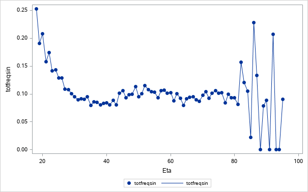

# Statistics for Insurance Homework
Homeworks from the Statistics for Insurance course of accademic year 2018/2019 at University of Trieste.

## Project description

The project consists of two parts:

1. Developing a Motor Third Party Liability (MTPL) Insurance Pricing model using [General Linear Models](https://en.wikipedia.org/wiki/General_linear_model) (GLM);
2. Developing a Reservation Model for MTPL Insurance claims using GLM.

All the SAS code is provided in the notebook `statAss_provaPratica.ipynb`. To open and compile the file I suggest to use SAS University Edition, that provides a Jupyter Lab environment where you can run SAS code. SAS University Edition is free and can be downloaded from [here](https://www.sas.com/en_us/software/university-edition/download-software.html).

The dataset provided in the directory `/data/` has been described in [_La tariffazione nei rami danni con modelli lineari generalizzati (P. Gigante, L. Picech, L. Sigalotti)_](https://www.mondadoristore.it/tariffazione-rami-danni-Liviana-Picech-Luciano-Sigalotti-Patrizia-Gigante/eai978888303283/).

## Disclaimer regarding the techniques used

The techniques used has been asked by the teacher. I am aware that considering all the explanatory variables as qualitative and merging the modality in few levels based just on fitness on training set could cause overfitting and bad model predictiveness.

The models could be significantly improved by using [Generalized Additive Models](https://en.wikipedia.org/wiki/Generalized_additive_model) (GAM) for the quantitative variables (such as policyholder's `age` and vehicle's `power`) and geospatial modeling techniques for location variables (such as policyholder's `province` of residence).

